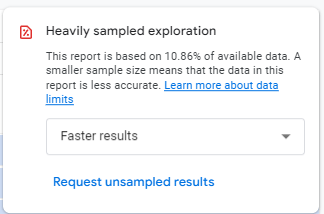

# Web Analytics Handbook.
 This is an ongoing project for documentation about web analytics tools and references. 
 The final objective is to have a quick references repository for general to specific consults.

---

## Google Analytics 4 (GA4)

  

### Useful resources
> [!TIP]
> Collection of useful resources with general use while implementing and using GA4.

1. [UTM builder for links](https://ga-dev-tools.google/ga4/campaign-url-builder/)
  > Google official _tool_ for creating UTMs parameters for URLs, it's important to explain the logic behind, but you can also have your own spreadsheet.
3. [Recommended events for GA4](https://developers.google.com/analytics/devguides/collection/ga4/reference/events)
  > Core documentation that explains the standard events. It's a good practice to respect this convection and try to apply business logics to adapt to these events.
  > But, of course, you can have custom events too. Nonetheless, it's highly recommended to start with the standard events first.
3. [GA4 demo account](https://support.google.com/analytics/answer/6367342)
  > Useful for public dashboard example creation and basic data exploration for newcomers to web analytics universe.1

---

### Core concepts
> [!TIP]
> Main concepts of ga4 that are important to be aware of.

1. [Data sampling](https://support.google.com/analytics/answer/13331292?hl=en)
 > Your report can be reporting basis in partial data, the free account quota limit is 10 million events.
 > 
 > 
 >
 > An example of a report with sampling, note that in GA4 paid account you can choose to have unsampled data.

### E-commerce

1. [E-commerce guide](https://www.simoahava.com/analytics/google-analytics-4-ecommerce-guide-google-tag-manager/#item-scoped-custom-dimensions)
  > Guide created by Simo that's ilustrate with examples how to manage several e-commerce implementations.

### Measure protocol (MP)

1. [MP reference](https://developers.google.com/analytics/devguides/collection/protocol/ga4/reference)
2. [Events and event parameters](https://developers.google.com/analytics/devguides/collection/protocol/ga4/reference/events)
3. [Event builder](https://ga-dev-tools.google/ga4/event-builder/)
4. [Debugging MP](https://www.analyticsmania.com/post/not-set-in-google-analytics-4/)
---
## Google Ads

  

### Performance Max Campaigns (PMAX)

1. [Asset group](https://support.google.com/google-ads/answer/10724492)
  > Specifications of assets needed for a PMAX campaign..
   

---
## Meta Ads

  

### Pixel implementation

1. [Best practices](https://www.analyticsmania.com/post/facebook-pixel-with-google-tag-manager/#send-data-to-multiple-pixels)
2. [Advanced Matching](https://developers.facebook.com/docs/meta-pixel/advanced/advanced-matching)

### Lead Ads
1. [Lead Ads Testing Tool](https://developers.facebook.com/tools/lead-ads-testing/)
---
## Mixpanel

  

### Tags implementation with GTM

1. [Events](https://docs.mixpanel.com/docs/tracking-methods/sdks/javascript#sending-events)
2. [Identify user](https://docs.mixpanel.com/docs/tracking-methods/id-management/identifying-users)
3. [Add user parameter](https://docs.mixpanel.com/docs/tracking-methods/sdks/javascript#setting-profile-properties)
---
## Cookies
### Google Privacy Sandbox

1. [Sandbox home](https://developers.google.com/privacy-sandbox)
2. [1% third-party cookie deprecation](https://developers.google.com/privacy-sandbox/blog/cookie-countdown-2023oct)
3. [Privacy Sandbox Analysis Tool (PSAT)](https://developers.google.com/privacy-sandbox/blog/psat-announcement)
